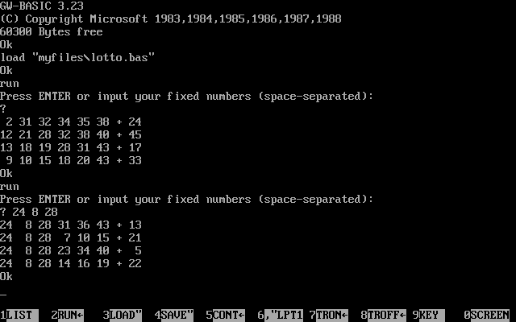
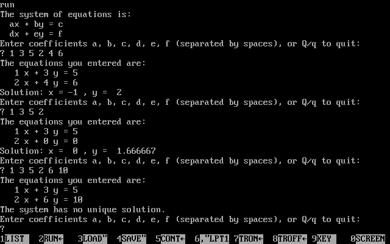
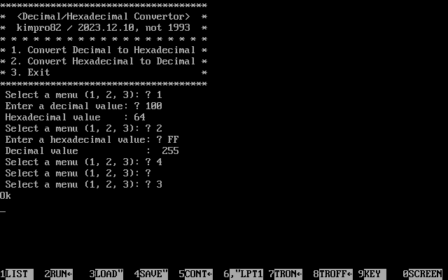
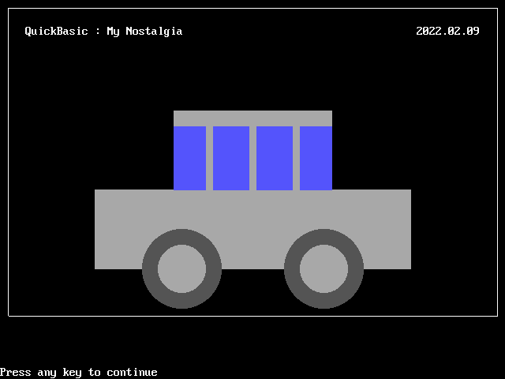

# [My Basic Practice](../README.md#basic)

My Nostalgia; codes for **the old BASIC product family** (*GW-BASIC*, *QuickBASIC* and so on) before [*Visual Basic*](https://github.com/kimpro82/MyPractice/blob/master/VBA)


### \<List>

- [Lotto 6/45 Number Generator (2024.08.28)](#lotto-645-number-generator-20240828)
- [Simultaneous Equations Solver (2024.08.20)](#simultaneous-equations-solver-20240820)
- [Decimal/Hexadecimal Convertor (2023.12.10)](#decimalhexadecimal-convertor-20231210)
- [Line Numbering 2 (2023.07.22)](#line-numbering-2-20230722)
- [Line Numbering (2023.07.19)](#line-numbering-20230719)
- [Draw A Car (2022.02.09)](#draw-a-car-20220209)
- [Play Music (2021.02.20)](#play-music-20210220)
- [Hello World (2020.02.27)](#hello-world-20200227)
- [References (2020.02.25)](#references-20200225)


## [Lotto 6/45 Number Generator (2024.08.28)](#list)

- Generates n sets of 7 unique numbers between 1 and 45
  - If user inputs numbers, those are fixed and others are generated
  - Displays the numbers in the format: a b c d e f + lucky number
- Migrated from https://github.com/kimpro82/MyBizApps/pull/61

  

- Code : `LOTTO.BAS`
  <details>
    <summary>100~190 : Main part</summary>

  ```bas
  100 SETSNUM = 4 ' Constant for the number of sets to generate
  110 RANDOMIZE TIMER ' Initialize random number generator

  120 PRINT "Press ENTER or input your fixed numbers (space-separated):"
  130 INPUT USERSTR$ ' Get user input

  140 DIM NUMSET(7) ' Declare array to hold one set of numbers
  150 ' Parse user input and validate
  160 IF USERSTR$ = "" THEN GOTO 200 ' No input, generate all random
  170 GOSUB 500 ' Validate and parse user input
  180 ' If invalid input, re-prompt user
  190 IF ERRORFLAG = 1 THEN PRINT "Invalid input. Please try again." : GOTO 110
  ```
  </details>
  <details>
    <summary>200~420 : Start generating sets of numbers</summary>

  ```bas
  200 ' Start generating sets of numbers
  210 FOR I = 1 TO SETSNUM ' Generate sets based on the constant
  220   GOSUB 900 ' Initialize array for each set
  230   COUNT = 0 ' Reset count for each set
  240   ' Fill array with user-provided numbers
  250   FOR J = 1 TO USERINDEX
  260     NUMSET(J) = USERNUMS(J)
  270     COUNT = COUNT + 1
  280   NEXT J
  290   ' Generate remaining random numbers
  300   WHILE COUNT < 7 ' Generate random numbers until the total count is 7
  310     NEWNUM = INT(RND * 45) + 1
  320     GOSUB 700 ' Check if number is already in the set
  330     IF INSET = -1 THEN GOTO 310 ' If number is already in the set, generate again
  340     COUNT = COUNT + 1
  350     NUMSET(COUNT) = NEWNUM
  360   WEND
  370   ' Sort only the numbers from position USERINDEX + 1 to 6, leaving the last number (NUMSET(7)) unsorted
  380   GOSUB 800 ' Sort the numbers from position USERINDEX + 1 to 6
  390   ' Display the result with numbers formatted to two characters each
  400   PRINT USING "## ## ## ## ## ## + ##"; NUMSET(1); NUMSET(2); NUMSET(3); NUMSET(4); NUMSET(5); NUMSET(6); NUMSET(7)
  410 NEXT I
  420 END
  ```
  </details>
  <details>
    <summary>500~690 : Subroutine to validate and parse user input</summary>

  ```bas
  500 ' Subroutine to validate and parse user input
  510 DIM USERNUMS(6) ' Maximum 6 numbers can be fixed
  520 USERINDEX = 0
  530 ERRORFLAG = 0
  540 ' Split user input by spaces
  550 TMP$ = "" ' Initialize temporary string
  560 FOR K = 1 TO LEN(USERSTR$)
  570   CHAR$ = MID$(USERSTR$, K, 1)
  580   IF CHAR$ >= "0" AND CHAR$ <= "9" THEN TMP$ = TMP$ + CHAR$
  590   IF CHAR$ <> " " AND K < LEN(USERSTR$) THEN GOTO 680
  600   IF LEN(TMP$) = 0 THEN GOTO 680
  610   VALNUM = VAL(TMP$)
  620   IF VALNUM < 1 OR VALNUM > 45 THEN ERRORFLAG = 1 : RETURN
  630   GOSUB 700 ' Check if number is already in the user input set
  640   IF INSET = -1 THEN ERRORFLAG = 1 : RETURN
  650   USERINDEX = USERINDEX + 1
  660   USERNUMS(USERINDEX) = VALNUM
  670   TMP$ = ""
  680 NEXT K
  690 RETURN
  ```
  </details>
  <details>
    <summary>700~750 : Subroutine to check if a number is in the set</summary>

  ```bas
  700 ' Subroutine to check if a number is in the set
  710 INSET = 0
  720 FOR L = 1 TO COUNT
  730   IF NUMSET(L) = NEWNUM THEN INSET = -1 : RETURN
  740 NEXT L
  750 RETURN
  ```
  </details>
  <details>
    <summary>800~880 : Subroutine to sort the numbers from position USERINDEX + 1 to 6</summary>

  ```bas
  800 ' Subroutine to sort the numbers from position USERINDEX + 1 to 6
  810 START = USERINDEX + 1
  820 ENDIDX = 6 ' Sort up to NUMSET(6), excluding NUMSET(7)
  830 FOR M = START TO ENDIDX - 1
  840   FOR N = M + 1 TO ENDIDX
  850     IF NUMSET(M) > NUMSET(N) THEN SWAP NUMSET(M), NUMSET(N)
  860   NEXT N
  870 NEXT M
  880 RETURN
  ```
  </details>
  <details>
    <summary>900~940 : Subroutine to initialize the NUMSET array</summary>

  ```bas
  900 ' Subroutine to initialize the NUMSET array
  910 FOR T = 1 TO 7
  920   NUMSET(T) = 0
  930 NEXT T
  940 RETURN
  ```
  </details>


## [Simultaneous Equations Solver (2024.08.20)](#list)

- System of Linear Equations Calculator using Determinant Method
  - Enter six floating-point numbers: `a`, `b`, `c`, `d`, `e`, and `f`
  - If fewer than six numbers are provided, zeros will be substituted for the missing values

  

- Code : `SESOLVER.BAS`
  <details>
    <summary>100~160 : Initialize and get input data</summary>

  ```bas
  100 ' Initialize and get input data
  110 DIM COEF#(5) ' Array to store coefficients
  120 PRINT "The system of equations is:"
  130 PRINT "  ax + by = c"
  140 PRINT "  dx + ey = f"

  150 PRINT "Enter coefficients a, b, c, d, e, f (separated by spaces), or Q/q to quit:"
  160 INPUT INPUTDATA$ ' Get user input
  ```
  </details>
  <details>
    <summary>200~250 : Check for quit command or process input</summary>

  ```bas
  200 ' Check for quit command or process input
  210 IF INPUTDATA$ = "Q" OR INPUTDATA$ = "q" THEN GOTO 900
  220 ' GOSUB 800 ' Initialize variables; Not use
  230 GOSUB 300 ' Process input or substitute missing values with zeros
  240 GOSUB 500 ' Solve the equations
  250 GOTO 150
  ```
  </details>
  <details>
    <summary>300~450 : Parse input or use default values</summary>

  ```bas
  300 ' Parse input or use default values
  310 INPUTDATA$ = INPUTDATA$ + " 0 0 0 0 0 0"  ' Pad the input with zeros if fewer than 6 values are provided
  320 INDEX = 1
  330 FOR I = 0 TO 5
  340   WORD$ = ""
  350   CONDITION = 1
  360   WHILE CONDITION
  370     CHAR$ = MID$(INPUTDATA$, INDEX, 1)
  380     IF CHAR$ <> " " THEN WORD$ = WORD$ + CHAR$ ELSE CONDITION = 0
  390     ' PRINT "I:"; I; "/ INDEX:"; INDEX; "/ CHAR:"; CHAR$; " / WORD:"; WORD$; " / CONDITION:"; CONDITION ' Debug print
  400     INDEX = INDEX + 1
  410   WEND
  420   COEF#(I) = VAL(WORD$)
  430 NEXT I
  450 RETURN
  ```
  </details>
  <details>
    <summary>500~650 : Solve the system of linear equations</summary>

  ```bas
  500 ' Solve the system of linear equations
  510 A = COEF#(0): B = COEF#(1): C = COEF#(2)
  520 D = COEF#(3): E = COEF#(4): F = COEF#(5)
  530 PRINT "The equations you entered are:"
  540 PRINT "  "; A; "x +"; B; "y ="; C
  550 PRINT "  "; D; "x +"; E; "y ="; F
  560 DETERMINANT = A * E - B * D

  600 IF DETERMINANT = 0 THEN PRINT "The system has no unique solution."
  610 IF DETERMINANT <> 0 THEN X = (C * E - B * F) / DETERMINANT
  620 IF DETERMINANT <> 0 THEN Y = (A * F - C * D) / DETERMINANT
  630 IF DETERMINANT <> 0 THEN PRINT "Solution: x = "; X; ", y = "; Y
  640 ' It is crazy to handle IF conditions in GW-BASIC!
  650 RETURN
  ```
  </details>
  <details>
    <summary>800~840 : Initialize variables; Not use</summary>

  ```bas
  800 ' Initialize variables; Not use
  810 ' FOR I = 0 TO 5
  820 '   COEF#(I) = 0 ' Set all coefficients to 0
  830 ' NEXT I
  840 ' RETURN
  ```
  </details>
  <details>
    <summary>900~920 : Quit the program</summary>

  ```bas
  900 ' Quit the program
  910 PRINT "Program terminated."
  920 END
  ```
  </details>


## [Decimal/Hexadecimal Convertor (2023.12.10)](#list)

- To practice Subroutine with `GOSUB` ~ `RETURN` statements
  - Reference : [8비트 컴퓨터에서 게임 만들기 (YouTube)](https://youtu.be/Z8yeXVqiKg8)
- Be aware of *BOM*(Byte-Order Mark; `EF BB BF`) signature generation when creating a code file with an external editor

  

  <details>
    <summary>Code : HEXCONV.BAS</summary>

    ```bas
    0 CLS

    10 PRINT "*************************************"
    20 PRINT "*  <Decimal/Hexadecimal Convertor>  *"
    30 PRINT "*  kimpro82 / 2023.12.10, not 1993  *"
    40 PRINT "* * * * * * * * * * * * * * * * * * *"
    50 PRINT "* 1. Convert Decimal to Hexadecimal *"
    60 PRINT "* 2. Convert Hexadecimal to Decimal *"
    70 PRINT "* 3. Exit                           *"
    80 PRINT "*************************************"
    90 INPUT " Select a menu (1, 2, 3): "; MENU

    100 IF MENU = 1 THEN GOSUB 200
    110 IF MENU = 2 THEN GOSUB 300
    120 IF MENU = 3 THEN END
    130 GOTO 90

    200 ' Subroutine for Decimal to Hexadecimal Conversion
    210 INPUT " Enter a decimal value: "; DEC
    220 PRINT " Hexadecimal value    : "; HEX$(DEC)
    230 RETURN

    300 ' Subroutine for Hexadecimal to Decimal Conversion
    310 INPUT " Enter a hexadecimal value: "; HEXA$
    315     ' The keyword HEX$(X) is already in use
    320 PRINT " Decimal value            : "; VAL("&H" + HEXA$)
    330 RETURN
    ```
  </details>


## [Line Numbering 2 (2023.07.22)](#list)

- Finally I've got [GW-BASIC 3.23](https://web.archive.org/web/20091027112638/http://geocities.com/KindlyRat/GWBASIC.html)!
- Reversed line numbers are automatically rearranged as increasing order
- Line numbers are allowed only when they are not exceeding `65529` and without decimal points.

  <details>
    <summary>Why `65529`, not `65535`?</summary>

  - [Variances in Basic highest line numbers](https://retrocomputing.stackexchange.com/questions/13347/variances-in-basic-highest-line-numbers)  [(retrocomputing.stackexchange.com)](https://retrocomputing.stackexchange.com/)

    > Line numbers are stored as a two byte word but the largest allowed by the input routines is 65529. Primarily because this is an easier limit to test rather than checking for overflow. The line number is converted from ASCII to binary a character at a time using a pretty standard algorithm. Start with a 16 bit value `line` = 0. For each digit multiply `line` by 10 and add the digit to `line`.  
    >  
    >  To check if the line number is acceptable, compare `line` against 6552 before multiplying it by 10. This will guarantee the value is <= 65529 because a digit can add only 9 at most.
  </details>
  <details>
    <summary>What does `!` mean?</summary>

  - [Microsoft > Learn > Documentation > .NET > Visual Basic](https://learn.microsoft.com/en-us/dotnet/visual-basic/) > [Single Data Type](https://learn.microsoft.com/en-us/dotnet/visual-basic/language-reference/data-types/single-data-type)

    This is not exactly GW-BASIC, but it is a descendant with some traces of its syntax.

    > Type Characters. Appending the literal type character `F` to a literal forces it to the `Single` data type. Appending the identifier type character `!` to any identifier forces it to `Single`.
  </details>

  <details open="">
    <summary>Code : LINENUM2.BAS</summary>

  - Saved in the file
    ```bas
    10 PRINT 10
    20 PRINT 20
    30 GOTO 50
    40 PRINT 40         ' Pass
    50 PRINT 50
    60 PRINT 60
    55 PRINT 55         ' Rearranged as increasing order
    70.5 PRINT 70.5     ' Syntax rrror; 70 .5 PRINT 70.5
    65530 PRINT 65530   ' Syntax rrror; 6553 0 PRINT 65530!
    65529 PRINT 65529   ' 65529!
    65531 PRINT 65531   ' Syntax rrror
    ```
  - Loaded on the GW-BASIC console
    ```bas
    10 PRINT 10
    20 PRINT 20
    30 GOTO 50
    40 PRINT 40             ' Pass
    50 PRINT 50
    55 PRINT 55             ' Rearranged as increasing order
    60 PRINT 60
    70 .5 PRINT 70.5                ' Syntax rrror; 70 .5 PRINT 70.5
    6553 0 PRINT 65530!     ' Syntax rrror; 6553 0 PRINT 65530!
    65529 PRINT 65529!      ' 65529!
    Syntax error
    ```
  - Output
    ```txt
    RUN
    10
    20
    50
    55
    60
    Syntax error in 70
    Ok
    ```
  </details>

## [Line Numbering (2023.07.19)](#list)

- I intended to write *GW-BASIC* code, but I actually executed it in *QuickBASIC*.
- Unexpectedly, many things are allowed, including aspects that were not even considered.  
  Ex) Line numbers including decimal points, reversed, or exceeding 65535 ……

  <details open="">
    <summary>Code : LineNum.bas</summary>

  ```bas
  '-10 print "-10"        ' A negative line number causes an error
  0 CLS
  10 PRINT "10"
  15 GOTO 30
  20 PRINT "20"           ' Pass
  30 PRINT "30"
  25 PRINT "25"           ' Decreasing numbering is OK
  30.5 PRINT "30.5"       ' Decimal point is allowed
  A: GOTO C
  B: PRINT "B"
  C: PRINT "C"            ' Alphanumeric line labels can be mixed
  PRINT "No label"        ' Lines without labeling is also available
  65535 PRINT "65535"
  65536 PRINT "65536"     ' The line number can be over 65536
  ```
  ```txt
  10
  30
  25
  30.5
  C
  No label
  65535
  65536
  ```
  </details>

- References
  - *The BASIC Program Line* from [QUICKBASIC 4.5 Help file](https://hwiegman.home.xs4all.nl/qb45-man/index.html)
  - [Q73084: Differences Between GW-BASIC and QBasic](https://jeffpar.github.io/kbarchive/kb/073/Q73084/)


## [Draw A Car (2022.02.09)](#list)

- Remember how I felt when I was a primary school student

  

  <details>
    <summary>Code : DrawCar.bas</summary>

  ```bas
  CLS

  SCREEN 12       '640 x 480 / 16 colors
  wid% = 640      'Can I get these parameters automatically?
  hei% = 480

  'Border
  LINE (10, 10)-(wid% - 10, 10), 15, B
  LINE (10, hei% - 80)-(wid% - 10, hei% - 80), 15, B
  LINE (10, 10)-(10, hei% - 80), 15, B
  LINE (wid% - 10, 10)-(wid% - 10, hei% - 80), 15, B

  'Memo
  LOCATE 3, 5
  PRINT "QuickBasic : My Nostalgia"
  LOCATE 3, 67
  PRINT "2022.02.09"

  'Body
  LINE (wid% / 2 - 100, hei% / 2 - 100)-(wid% / 2 + 100, hei% / 2), 7, BF
  LINE (wid% / 2 - 200, hei% / 2)-(wid% / 2 + 200, hei% / 2 + 100), 7, BF

  'Windows
  LINE (wid% / 2 - 100, hei% / 2 - 80)-(wid% / 2 - 60, hei% / 2), 9, BF
  LINE (wid% / 2 - 50, hei% / 2 - 80)-(wid% / 2 - 5, hei% / 2), 9, BF
  LINE (wid% / 2 + 5, hei% / 2 - 80)-(wid% / 2 + 50, hei% / 2), 9, BF
  LINE (wid% / 2 + 60, hei% / 2 - 80)-(wid% / 2 + 100, hei% / 2), 9, BF

  'Wheels
  CIRCLE (wid% / 2 - 90, hei% / 2 + 100), 50, 8
  CIRCLE (wid% / 2 + 90, hei% / 2 + 100), 50, 8
  PAINT (wid% / 2 - 120, hei% / 2 + 100), 8, 8
  PAINT (wid% / 2 + 120, hei% / 2 + 100), 8, 8
  CIRCLE (wid% / 2 - 90, hei% / 2 + 100), 30, 7
  CIRCLE (wid% / 2 + 90, hei% / 2 + 100), 30, 7
  PAINT (wid% / 2 - 90, hei% / 2 + 100), 7, 7
  PAINT (wid% / 2 + 90, hei% / 2 + 100), 7, 7

  END
  ```
  </details>


## [Play Music (2021.02.20)](#list)

- Practice of functions : `BEEP` `SOUND` `PLAY`
- Run by *MS QuickBASIC 4.5*

  <details>
    <summary>Code : Xerxes.bas</summary>

  - Using `SHELL` function to borrow the `CLS` command from DOS
  ```bas
  SHELL "CLS"
  PRINT "I am generous"
  ```
  > I am generous
  </details>
  <details>
    <summary>Code : Sound.bas</summary>

  - Refer to ☞ https://en.wikibooks.org/wiki/QBasic/Sound
  ```bas
  SHELL "CLS"

  'BEEP
  PRINT "BEEP"
  BEEP
  PRINT CHR$(7)
  SLEEP

  'SOUND
  PRINT "SOUND" + CHR$(13) 'CHR$(13) : Line break
  FOR i% = 1 TO 30
          SOUND i% * 100, 1  'Frequency, Duration
  NEXT
  SLEEP

  'PLAY
  PRINT "PLAY" + CHR$(13)
  PLAY "L16 CDEFGAB>C" '> : Move up one octave
  SLEEP
  ```
  </details>

  - **Results** : [BEEP](./Sounds/QB_SOUND_BEEP.wav) [SOUND](./Sounds/QB_SOUND_SOUND.wav) [PLAY](./Sounds/QB_SOUND_PLAY.wav)  
  (* These can't be played directly, but played after downloading.)

  <details open="">
    <summary>Code : SchoolBell.bas</summary>

  - Play the same song with the keys of both C major and C minor
  ```bas
  SHELL "CLS"

  PRINT "School Bell"

  PRINT "C major"
  PLAY "MS G8G8A8A8 G8G8E4 G8G8E8E8 D6 P8"
  PLAY "MS G8G8A8A8 G8G8E4 G8E8D8E8 C6 P8"

  PRINT "C minor"
  PLAY "MS G8G8A-8A-8 G8G8E-4 G8G8E-8E-8 D6 P8"
  PLAY "MS G8G8A-8A-8 G8G8E-4 G8E-8D8E-8 C6 P8"
  ```
  </details>

  - **Results** : [C major](./Sounds/QB_PLAY_C%20major.wav) [C minor](./Sounds/QB_PLAY_C%20minor.wav)  
  (* These can't be played directly, but played after downloading.)


## [Hello World (2020.02.27)](#list)

- `PRINT`, not `print`

  <details>
    <summary>Code : HelloWorld.bas</summary>

  ```bas
  print "Hello World!"
  ```
  > Call to undefined sub 'print'

  ```bas
  print("Hello World!")
  ```
  > Call to undefined sub 'print'

  ```bas
  print 'Hello World!'
  ```
  > Call to undefined sub 'print'

  How can I make `print` work?

  ```bas
  PRINT "Hello World!"
  ```
  > Hello World!

  The secret was UPPER CASE!

  ```bas
  PRINT 'Hello World!'
  ```
  >
  `''` seems to be used for single-line comments.

  ```bas
  'You can't see what I'm saying.'
  ```
  ㅋ
  </details>


## [References (2020.02.25)](#list)

  <details open="">
    <summary>Links</summary>

  - BASIC
    - BASIC (Wikipedia)  
      https://en.wikipedia.org/wiki/BASIC
  - QuickBASIC
    - QuickBASIC (Wikipedia)  
      https://en.wikipedia.org/wiki/QBasic
  - QBasic
    - Online IDE for QBasic  
      https://repl.it/
    - QBasic/Full Book View (Wikibooks)  
      https://en.wikibooks.org/wiki/QBasic/Full_Book_View
    - Programmed Lessons in QBasic (Central Connecticut State University)  
      https://chortle.ccsu.edu/QBasic/ 
    - QBasic Tutorials and Articles (QBasic Cafe)  
      https://www.qbasic.net/en/qbasic-articles/
  - QB64
    - QBasic / QB64 Tutorial List (SchoolFreeware)  
      https://www.schoolfreeware.com/QBasic_Tutorials_-_QB64_Tutorials_-_Programming_And_Code_Examples.html     
  </details>
